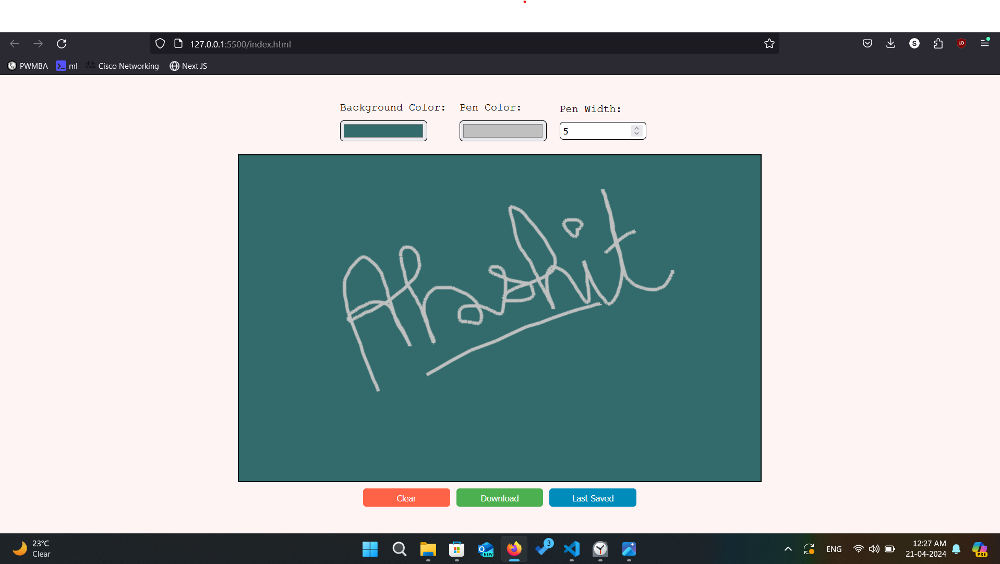

# Signature Canvas

Signature Canvas is a simple web application that allows users to draw and save their signatures on a HTML canvas element. This project provides basic functionalities such as changing background color, pen color, and pen width, as well as options to clear the canvas and download the signature as an image.

## Live Demo

Check out the live demo [here](https://akshitkamboz13.github.io/signatureAppHtmlCssJs/).



## Features

- **Drawing**: Users can draw their signatures using a mouse or touch input on the canvas.
- **Customization**: Users can customize the background color, pen color, and pen width according to their preferences.
- **Clear Canvas**: Users can clear the canvas to start over.
- **Download Signature**: Users can download their signature as a PNG image file.
- **Last Saved**: Users can revert the canvas to its last saved state.

## Technologies Used

- **HTML5**: Provides the structure of the web page.
- **CSS3**: Styles the elements on the web page.
- **JavaScript**: Implements the functionality of the signature canvas.

## Getting Started

To run the Signature Canvas project locally, follow these steps:

1. Clone this repository to your local machine:

    ```bash
    git clone <repository-url>
    ```

2. Open the `index.html` file in your web browser.

## Usage

1. Choose a background color, pen color, and pen width using the respective input fields.
2. Draw your signature on the canvas by clicking and dragging the mouse or using touch input.
3. Use the "Clear" button to clear the canvas and start over.
4. Use the "Download" button to save your signature as a PNG image file.
5. Use the "Last saved" button to revert the canvas to its last saved state.

## Contributing

Contributions are welcome! If you'd like to contribute to this project, please follow these steps:

1. Fork this repository.
2. Create a new branch for your feature or fix: `git checkout -b feature-name`.
3. Make your changes and commit them: `git commit -m 'Add new feature'`.
4. Push to the branch: `git push origin feature-name`.
5. Submit a pull request.

## Acknowledgements

- This project is inspired by [example code snippets](https://developer.mozilla.org/en-US/docs/Web/API/Canvas_API/Tutorial) provided by Mozilla Developer Network.
